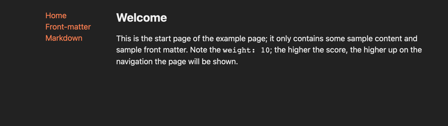

# Dart SSG POC

> This project is not really developed for production use. It is more of an experiment; Even though it is fully
> functional (but not tested 😉).

## About

This project is separated into two parts; first the generator (directory `gen`); which is written in `dart` and assumes a
directory (`content`) relative to the CWD to create a static website based off of it in `out`; `out`, as a directory,
must not exist – it'll be created. The generator is very forgiving and just does nothing if the `content` directory isn't
available.

The content may be written in **Markdown** (and may content *front-matter* – which will be used to influence the menu)
and the provided style in **SCSS**; The page will create a self-containing menu on the left, and render the content on the
right.
The style can be easily changed by just providing a new file; more extensive changes must be done via actually changing
the code of the SSG.

--

The second part is the `go` server (directory `srv`) actually exposing the page; right now it is just serving the
mounted directory; i have an idea to actually extend the rendering to a JSON format aswell; so it is possible to use
e.g. bleve to create an automatic index of the contents and therefore allow for a site search.

## Quickstart

### Requirement

* Docker

### Command

`make run`

## Example

`example` contains the example page provided. The content can simply be replaced to create and serve your own content.
Take a look at the documents for reference what a file must contain. `index.md` in the root will be treated as "start
page".

Changing the `style.scss` in `example-config` will affect the pages look.

To test updates or changes; just re-execute `make run`;
